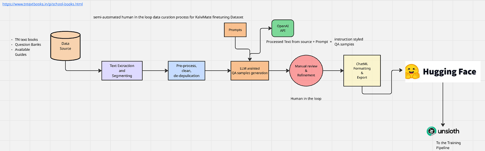

## KalviMate - an offline-capable, fine-tuned AI tutor built using Gemma 3n and Unsloth

**An offline-first, syllabus-aligned educational AI, fine-tuned on Gemma 3n to provide equitable access to high-quality learning.**

---

## 🌟 Project Vision

KalviMate is an offline-capable, fine-tuned AI tutor built to help students in Tamil Nadu (currently) learn directly from their state board textbooks even without internet access. At its core, KalviMate transforms a powerful base model into a personal teacher that explains concepts, solves problems, and interacts naturally. The entire model runs fully on-device, offering privacy-first, equitable access to high-quality learning anytime, anywhere.

---

## 🎯 The Problem We're Solving

Students in rural or under-resourced areas of Tamil Nadu often lack consistent access to quality teachers or the internet. Even with government-supplied tablets, most edtech tools fail because they:
- Require a constant online connection.
- Don't support the local language (Tamil).
- Are not aligned with the official state board syllabus.

There is no existing AI tool that can explain the Tamil Nadu curriculum interactively and run entirely offline on low-cost devices.

## 💡 Our Solution: KalviMate

We are fine-tuning **Gemma 3n** with a custom-curated dataset extracted and structured directly from Tamil Nadu's state board textbooks. This turns a generic model into a specialized tutor that acts as a:
- **Subject Expert:** Provides accurate, syllabus-aligned answers.
- **Concept Explainer:** Breaks down complex topics with simple analogies.
- **Problem Solver:** Helps students work through textbook questions.
- **Study Companion:** Engages students with quizzes and proactive conversation.

### Key Features
- **Ask Questions Naturally:** Interact in simple, conversational English.
- **Get Syllabus-Aligned Answers:** All knowledge is derived directly from the official curriculum.
- **Works 100% Offline:** Runs on-device, making it perfect for low-connectivity areas.
- **Privacy-First:** No student data ever leaves the device.
- **Behaves Like a Real Tutor:** Friendly, patient, and always encouraging.

---

## 🛠️ Technology Stack & Architecture

- **Core Model:** **Gemma 3n** (2B-IT) - Compact, efficient, and optimized for on-device inference.
- **Fine-Tuning Library:** **Unsloth** - For highly efficient, LoRA-based fine-tuning with a low memory footprint.
- **Data Generation:** **OpenAI API (gpt-4o-mini)** - Used via the Batch API to cost-effectively generate the initial conversational dataset.
- **Dataset Hosting:** **Hugging Face Hub** - For versioning and easy access to the training data.
- **Core Language:** **Python 3.10+**

## 📚 Resource & References
 - [Gemma 3n Impact challenge](https://www.kaggle.com/competitions/google-gemma-3n-hackathon/overview/abstract)
 - [Gemma 3n finetuning using unsloth](https://docs.unsloth.ai/basics/gemma-3n-how-to-run-and-fine-tune)

### Data Generation Pipeline
Our dataset was created using a semi-automated, human-in-the-loop process to ensure the highest quality:

1.  **Data Extraction:** TN State Board textbook content (`.epub`) was extracted and segmented into chapter and topic-specific JSON files (`extract_and_segment.py`).
2.  **Pre-processing:** The raw text was cleaned, normalized, and de-duplicated to create a clean corpus (`preprocess.py`).
3.  **Prompt Engineering:** 5 distinct, pedagogically-sound prompt templates were created to generate different types of conversational data (MCQs, analogies, etc.).
4.  **LLM-Assisted Generation:** A script (`generate_batch_file.py`) combined the processed text with the prompt templates to create a batch input file. This file was processed by the OpenAI Batch API to generate the raw conversational samples.
5.  **Curation & Formatting:** A final script (`process_batch_results.py`) parsed the raw API output, validated the conversational structure, added a system message, and formatted the data into the required ChatML format.
6.  **Dataset Creation:** The final, cleaned data was converted into a Hugging Face `Dataset` object, split into train/test sets, and pushed to the Hub.

---

## 🚀 How to Run
Refer readme in the `src/` directory

### Prerequisites
- Python 3.10+
- An OpenAI API Key
- A Hugging Face account and an access token (`Write` permission)
---

## 🔮 Future Vision & Roadmap

- **Full Tamil Language Support:** The Model adapted the teaching style present in the english dataset well for Tamil as well, although we have plan to generate a parallel dataset in Tamil to make KalviMate more native.
- **Multimodal Capability:** Extend the model to understand and answer questions about diagrams, charts, and images from the textbooks.
- **Scale to More Subjects:** Apply the same data pipeline to other subjects like Mathematics, Social science, and higher-grade sciences.
- **Government Partnership:** Collaborate with the Tamil Nadu government to preload KalviMate onto the tablets/laptops distributed to students, creating a direct and massive impact.

---

This project lays the foundation for AI-driven educational equity, starting in Tamil Nadu and with the potential to scale across India and beyond.