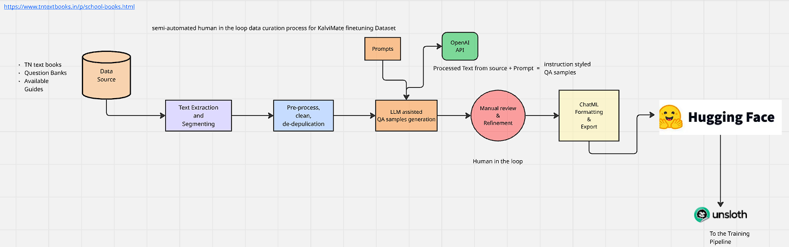

# Data processing pipeline - KalviMate

This data processing pipeline designed to build a fine-tuning dataset for an AI tutor from a source textbook. The project automates the extraction, cleaning, and generation of conversational data using the OpenAI Batch API, culminating in a ready-to-use dataset on the Hugging Face Hub.





## Core Features

-   **EPUB Parsing**: Extracts and intelligently structures content from an EPUB textbook into chapters and topics.
-   **Text Preprocessing**: Cleans OCR errors, normalizes unicode, and formats mathematical and scientific notation in the extracted text.
-   **Dynamic Input Generation**: Creates thousands of prompt-based API requests from the processed textbook content.
-   **Batch Processing**: Efficiently handles large-scale data generation using the OpenAI Batch API.
-   **Automated Splitting**: Splits large batch files into smaller, manageable chunks based on token limits to meet API constraints.
-   **Robust Output Cleaning**: Parses, cleans, and standardizes the generated JSONL output from the LLM, handling common errors and inconsistencies.
-   **Dataset Publishing**: Formats the cleaned data into conversations and uploads it directly to the Hugging Face Hub.

## Required structure for data preparation (Organized)

```
kalvimate/
├── .env
├── .gitignore
├── README.md
├── requirements.txt
├── data/
│   ├── raw/
│   │   └── textbook.epub
│   ├── structured_chapters/
│   │   └── (Output of extract_and_segment.py)
│   ├── preprocessed_chapters/
│   │   └── (Output of preprocess.py)
│   ├── openai_inputs/
│   │   └── (Output of generate_batch_input_file.py and split_batch_file.py)
│   └── clean_outputs/
│       └── (Output of create_batch_job.py)
├── prompts/
│   ├── MCQ_based.txt
│   ├── detailed_topic_breakdown.txt
│   └── ...
└── src/
    ├── create_batch_job.py
    ├── extract_and_segment.py
    ├── generate_batch_input_file.py
    ├── preprocess.py
    ├── process_batch_result.py
    └── split_batch_file.py
```

## End-to-End Workflow

Follow these steps to run the entire data generation pipeline from start to finish.

### Step 0: Initial Setup

1.  **Clone the repository:**
    ```bash
    git clone https://github.com/your-username/kalvimate.git
    cd kalvimate
    ```

2.  **Create a virtual environment and activate it:**
    ```bash
    python -m venv venv
    source venv/bin/activate  # On Windows, use `venv\Scripts\activate`
    ```

3.  **Install the required dependencies:**
    ```bash
    pip install -r requirements.txt
    ```

4.  **Set up your environment variables:**
    -   Create a new `.env` file in the root
    -   Edit the `.env` file and add your secret keys:
        ```env
        # Your secret key for OpenAI API
        API_KEY="sk-..."

        # Your Hugging Face access token with write permissions
        HF_TOKEN="hf_..."
        ```
5.  **Add your textbook**: Place your EPUB file inside the `data/raw/` directory (e.g., `data/raw/textbook.epub`).

### Step 1: Extract and Structure Content

Parse the EPUB file to create structured JSON files for each chapter, organized by topics.

```bash
python src/extract_and_segment.py
```
-   **Input**: `data/raw/textbook.epub`
-   **Output**: JSON files in `data/structured_chapters/`

### Step 2: Preprocess Content

Clean the text within the structured JSON files. This step corrects OCR errors, formatting, and mathematical notations.

```bash
python src/preprocess.py
```
-   **Input**: `data/structured_chapters/`
-   **Output**: Cleaned JSON files in `data/preprocessed_chapters/`

### Step 3: Generate Batch Input File

Create a single, large `.jsonl` file containing all the API requests for the OpenAI Batch API, based on the cleaned chapters and the various prompts in the `prompts/` directory.

```bash
python src/generate_batch_input_file.py
```
-   **Input**: `data/preprocessed_chapters/` and `prompts/`
-   **Output**: A large `openai_batch_input_file.jsonl` in the root directory.
-   *This script also provides a cost estimation for the batch job.*

### Step 4: Split the Batch File (If Necessary)

OpenAI's Batch API has limits on file size. This script splits the large `.jsonl` file into smaller chunks based on a token limit.

```bash
python src/split_batch_file.py --input-file openai_batch_input_file.jsonl
```
-   **Input**: `openai_batch_input_file.jsonl`
-   **Output**: Split files (e.g., `..._split_1.jsonl`) in `data/openai_inputs/`

### Step 5: Create and Monitor the OpenAI Batch Job

Upload each split file to OpenAI, create a batch job, and monitor its status until completion. The script will automatically download the results.

Run this command for **each split file** generated in the previous step.

```bash
python src/create_batch_job.py --input-file data/openai_inputs/openai_batch_input_file_split_1.jsonl
```
-   **Input**: A split `.jsonl` file from `data/openai_inputs/`.
-   **Output**: The resulting `.jsonl` output file from OpenAI in `data/clean_outputs/`.

### Step 6: Process Batch Results and Upload to Hub

Parse all the generated output files, run a final cleaning and normalization pipeline, add the system message, and upload the final, structured conversational dataset to the Hugging Face Hub.

```bash
python src/process_batch_result.py --repo-id "your-hf-username/your-dataset-name"
```
-   **Input**: All `.jsonl` files in `data/clean_outputs/`.
-   **Output**: A new dataset on the Hugging Face Hub.
-   **Dry Run**: To test the process without uploading, add the `--no-upload` flag. This will generate a `processed_dataset.json` file locally for inspection.

## Scripts Overview

-   `src/extract_and_segment.py`: Parses an EPUB file into structured JSON chapters.
-   `src/preprocess.py`: Cleans and standardizes the text content of the structured JSONs.
-   `src/generate_batch_input_file.py`: Combines prompts and chapter content to create a master request file for the OpenAI Batch API.
-   `src/split_batch_file.py`: A utility to break down the master request file into smaller chunks suitable for the API.
-   `src/create_batch_job.py`: Manages the lifecycle of an OpenAI batch job: uploads the input file, starts the job, monitors it, and downloads the result.
-   `src/process_batch_result.py`: The final step. It cleans the messy LLM output, formats it into valid conversations, and pushes the final dataset to the Hugging Face Hub.